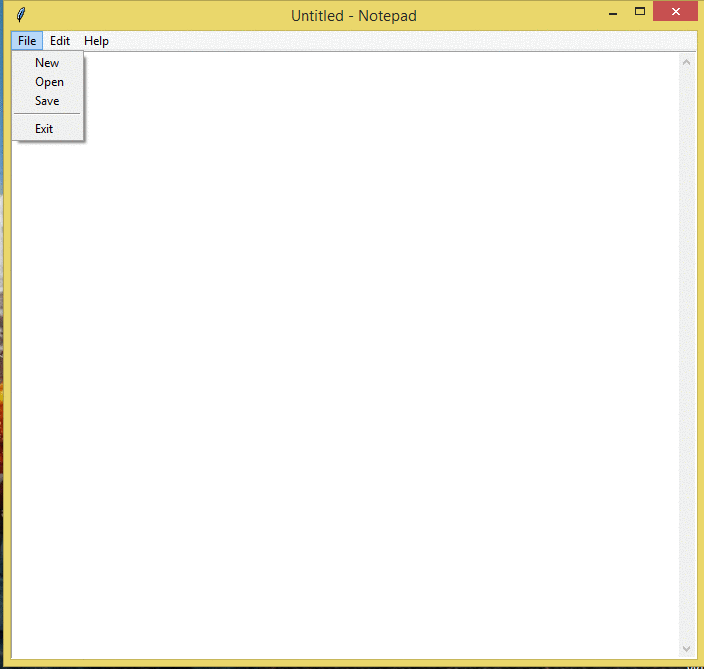

Write down quick notes and print a simple text document with Online Notepad editor. It includes spellchecker, word counter, autosave, find and replace etc.

  

## Download
You can [download](https://github.com/coder-lokesh/Notepad) 

## Credits
- [Python](https://www.python.org/)
- [Tkinter](https://docs.python.org/3/library/tkinter.html)

> [Lokesh Sharma](http://lokesh-resume.web.app/) &nbsp;&middot;&nbsp;
> GitHub [@Github](https://github.com/coder-lokesh) &nbsp;&middot;&nbsp;
> Twitter [@Twitter](https://twitter.com/lokeshs97047988) &nbsp;&middot;&nbsp;
> Linkdlen [@Linkdlen](https://www.linkedin.com/in/lokesh-sharma-908857193/) &nbsp;&middot;&nbsp;

